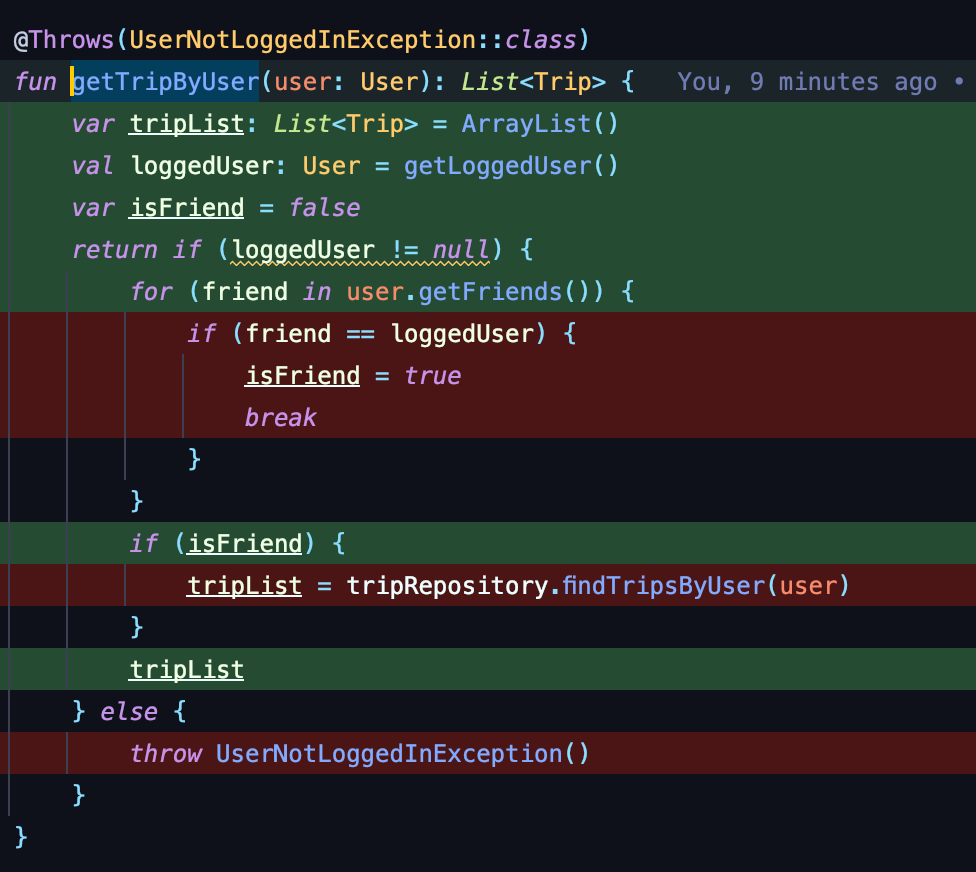

안녕하세요. 오늘은 [`레거시 코드에 유닛 테스트를 100%를 작성하기 1편`](https://sabarada.github.io/kotlin_legacy_code_refactoring_using_testcode_1)에 이어서 테스트를 통해 실제로 라인커버리지를 100% 달성해보는 포스팅을 진행해보고자 합니다. 이전 편은 `테스트 코드를 작성해야 하는 이유`에 대해서 설명했습니다. 관심있으신 분들은 한번 보시는것을 추천드립니다.

## 환경 

이번 포스팅과 다음 포스팅에 진행되는 test 환경에는 JUnit5와 코틀린 mock에 주로 사용하는 mockk 라이브러리를 이용하였습니다. build.gradle.kts의 implementation는 아래와 같이 선언하였습니다.

```kotlin
// JUnit5
testImplementation("org.springframework.boot:spring-boot-starter-test") {
    exclude(group = "org.junit.vintage", module = "junit-vintage-engine")
}

// mockk
testImplementation("io.mockk:mockk:1.12.3")
```

## 샘플 코드

오늘 테스트할 원본 코드는 아래와 같습니다. 한눈에 보더라도 레거시 코드인것 처럼 보입니다. 해당 메서드는 로그인한 유저가 파라미터로 받은 유저와 친구라면 여행리스트를 불러오는 메서드입니다. 한눈에 봤을 때 코드의 로직 흐름을 파악하기 어렵고 validation 코드와 실제 비즈니스 로직이 혼재해 있는 상태입니다. 이 코드를 안전하게 리팩토링하기 위해서 사전작업으로 테스트 코드를 만들어보도록 하겠습니다.

```kotlin
@Throws(UserNotLoggedInException::class)
fun getTripByUser(user: User): List<Trip> {
    var tripList: List<Trip> = ArrayList()
    val loggedInUser: User = UserSession.getInstance().getLoggedUser()
    var isFriend = false
    return if (loggedUser != null) {
        for (friend in user.getFriends()) {
            if (friend == loggedUser) {
                isFriend = true
                break
            }
        }
        if (isFriend) {
            tripList = tripRepository.findTripsByUser(user)
        }
        tripList
    } else {
        throw UserNotLoggedInException()
    }
}
```

## 테스트와 코드 커버리지

이제 테스트 코드를 작성하고 해당 테스트 코드에 따른 코드 커버리지를 확인해보는 시간을 가져보도록 하겠습니다. 코드 커버리지를 확인하는 방법은 [이전 포스팅]((https://sabarada.tistory.com/221))에 있으니 참고하시기 바랍니다. 

### 코드와 커버리지

처음에는 기본적인 테스트를 한번 작성해보도록 하겠습니다. 해당 객체를 선언하고 `getTripByUser`를 테스트 코드에서 호출해보도록 하겠습니다.

```kotlin
private val sampleService: SampleService = SampleService()

@Test
fun getTripByUser() {
    val user = User(emptyList())

    sampleService.getTripByUser(user)
}
```

테스트 결과 코드커버리지가 어떻게 되는지 아래 이미지를 확인해보도록 하겠습니다. 해당 테스트로 커버가 되는 부분은 초록색으로 되지 않는 부분은 빨간색으로 표시되는것을 확인하실 수 있습니다. 여기서 `var isFriend` 부분을 커버하지 못한 이유는 UserSession으로 static 메서드를 호출하는데 여기서 에러가 났기 때문입니다.


## static 클래스를 mockking 하자

그렇다면 우리는 이제 static 클래스의 메서드를 mockking하고 stub을 만들어야하는것을 알게되었습니다. 어떻게 할 수 있을까요? **test 방법에 spy라는 개념이 있습니다. 해당 개념은 테스트하고자 하는 클래스의 로직을 기본적으로 남겨두고 특정 메서드만 mocking 할 수 있는 개념**인데요. mockk를 이용하면 이 spy에서 dynamic call이라는 private method mockking 방법을 제공하고 있습니다. 해당 방법을 이용하면 손 쉽게 이를 해결할 수 있습니다. 각 용어에 대해서는 이전에 제가 작성한 [[mockk] 코틀린 테스트 프레임워크에 대해서 알아보자](https://sabarada.tistory.com/191)를 참고하시면 좋을것 같습니다. 


먼저 해당하는 static 메서드를 private method로 래핑 합니다. 아래코드에서는 `getLoggedUser()`라는 이름으로 래핑하였습니다.

```kotlin
@Throws(UserNotLoggedInException::class)
fun getTripByUser(user: User): List<Trip> {
    var tripList: List<Trip> = ArrayList()
    val loggedUser: User = getLoggedUser() // static 메서드를 private method로 래핑
    var isFriend = false
    return if (loggedUser != null) {
        for (friend in user.getFriends()) {
            if (friend == loggedUser) {
                isFriend = true
                break
            }
        }
        if (isFriend) {
            tripList = tripRepository.findTripsByUser(user)
        }
        tripList
    } else {
        throw UserNotLoggedInException()
    }
}

private fun getLoggedUser(): User {
    return UserSession.getInstance().getLoggedUser()
}
```

그리고 이제 테스트 코드를 수정하도록 하겠습니다. 먼저 `SampleService`로 해당 메서드가 있었던 클래스를 spyk를 이용해서 spy 클래스로 만들어줍니다. 이때 recordPrivateCalls 옵션을 통해서 private method를 mockking할 수 있도록 합니다. 그리고 실제 테스트 코드에서 every, 그리고 dynamic call을 이용하여 stub을 이용하면 됩니다. 

```kotlin
private val sampleService: SampleService = spyk( // 일반 클래스 spy 클래스로 변환
    objToCopy = SampleService(),
    recordPrivateCalls = true // private method를 mockking 할 수 있도록 해당 옵션 true로 변경
)

@Test
fun getTripByUser() {
    val user = User()

    every { sampleService["getLoggedUser"]() } returns user // dynamic call 처리로 private method stub 처리 

    sampleService.getTripByUser(user)
}
```

그리고 테스트를 돌리면 아래와 같이 static 호출 method를 통과하는 것을 확인할 수 있습니다.



## 객체에 더미 데이터 넣기

for문에서 내부에 들어가지 못한 이유는 emptyList를 가지고 있었기 때문입니다. 따라서 stub으로 반환해주는 객체를 list를 포함하는 객체로 변경합니다. 또한 `tripRepository.findTripsByUser(user)` 역시 외부 의존성으로 별도의 mockking 및 stub이 필요하므로 진행해줍니다. 외부 의존성은 아래처럼 기본적인 호출을 stub 해주는 코드로 작성하면 됩니다.

```kotlin
private val sampleService: SampleService = spyk(
    objToCopy = SampleService(),
    recordPrivateCalls = true
)

@Test
fun getTripByUser() {
    val user2 = User(emptyList())
    val user = User(listOf(user2))

    every { sampleService["getLoggedUser"]() } returns user2
    every { tripRepository.findTripsByUser(user) } returns listof(Trip(), Trip()) // 외부 의존성에 대한 stub

    sampleService.getTripByUser(user)
}
```

그렇게 했을 때 코드 커버리지를 보도록 하겠습니다. 아래와 같이 이제 else 부분만 빼고 모두 커버되는것을 확인할 수 있습니다.


## 반복하며 다른 함수 실행시키기

보통 이경우에 모두 커버하기 위해서는 테스트 코드를 쪼갭니다. 즉, if를 타는 테스트 메서드와 else를 타는 테스트로 말입니다. 하지만 이번에는 하나의 테스트 메서드에서 2번 각각 다르게 되도록 호출하였습니다. 코드는 아래와 같습니다. returnsMany를 이용하면 호출 순서에따라 다르게 반환하도록 가능합니다.

```kotlin
private val sampleService: SampleService = spyk(
    objToCopy = SampleService(),
    recordPrivateCalls = true
)

@Test
fun getTripByUser() {
    val user2 = User(emptyList())
    val user = User(listOf(user2))

    every { sampleService["getLoggedUser"]() }.returnsMany(user2, null) // 처음 호출은 user2, 두번째는 null을 반환합니다.
    sampleService.getTripByUser(user) // 처음 호출
    sampleService.getTripByUser(user) // 두번째 호출
}
```

그리고 아래처럼 모든 코드가 커버되는 것을 확인할 수 있습니다.


## 마무리

이제 리팩토링을 하기 위한 기초 작업은 마무리 되었습니다. 남은 일은 이렇게 짜여진 테스트 코드를 기반으로 리팩토링을 진행하는 것입니다. 테스트 코드를 짜고 리팩토링을하면 리팩토링했을 때 잘못하는 케이스를 막을 수 있으므로 자신감있게 할 수 있게 됩니다.

다음시간에는 리팩토링을 진행해보도록 하겠습니다. 

감사합니다.

## 참조

[1] https://www.youtube.com/watch?v=LSqbXorkyfQ

[2] https://mockk.io